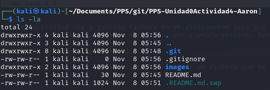

# PPS-Unidad0Actividad4-Aaron

En esta actividad voy a guardar fichero en **.gitignore** para que no se suban al repositorio (que no se rastreen).
Podemos ignorar ficheros por su extensión, por ejemplo **txt**. También podemos directamente ignorar directorios completos.

## Ignorar ficheros (.gitignore)

1. El primer paso para ignorar ficheros es crear un fichero que se llama **.gitignore** dentro de la carpeta local de nuestro proyecto.
Podemos usar el comando **touch .gitignore** para su creación. Si mostramos el directorio *local* con **ls -la** debe contener el fichero **.gitignore** de la siguiente manera.

2. El siguiente paso para ignorar los ficheros o directorios, es agregar dentro del fichero que hemos *creado anteriormente* las reglas que queremos que cumplan los ficheros que no queremos subir.
En mi caso por ejemplo, si no quiero que se suban fichero con extensión *.txt* tengo que agregar _*.txt_.

 
