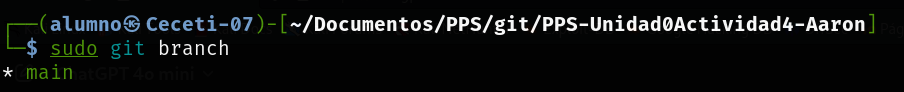

# PPS-Unidad0Actividad4-Aaron

En esta actividad voy a guardar fichero en **.gitignore** para que no se suban al repositorio (que no se rastreen).
Podemos ignorar ficheros por su extensión, por ejemplo **txt**. También podemos directamente ignorar directorios completos.

También vamos a publicar en local una pequeña web mediante un *servidor web* alojado en local bajo el puerto **8080**.

## Ignorar ficheros (.gitignore)

1. El primer paso para ignorar ficheros es crear un fichero que se llama **.gitignore** dentro de la carpeta local de nuestro proyecto.
Podemos usar el comando **touch .gitignore** para su creación. Si mostramos el directorio *local* con **ls -la** debe contener el fichero **.gitignore** de la siguiente manera.

```bash 
cd ruta_del_proyecto
touch .gitignore
nano .gitignore
 
```

2. El siguiente paso para ignorar los ficheros o directorios, es agregar dentro del fichero que hemos *creado anteriormente* las reglas que queremos que cumplan los ficheros que no queremos subir.
En mi caso por ejemplo, si no quiero que se suban fichero con extensión *.txt* tengo que agregar _*.txt_.


## Crear web local

1. Crear un fichero html
He creado un fichero **index.html** que contiene *"Hola mundo Aarón"*.

```bash
echo "<H1>Hola mundo Aarón</H1>" > index.html
```
Una vez creado el fichero, he comprobado el estado de git con *git status* y he agregado el **index.html** para subirlo a un commit y luego a la rama **main**.

```bash
git status
git add index.html
git commit -m "creacion del index"
git push origin main
```


2. Arrancar un servidor web
El servidor que arrancamos en local coge por defecto el fichero **index.html** que haya en la ruta donde se arranque el servidor **PHP**.

```bash
php -S 0:8080
```

Si accedemos desde el navegador al puerto donde hemos levantado el servidor veremos el contenido del **HTML interpretado**.


## Comparar ficheros modificados

He modificado el fichero **index.html** después de guardar una copia del mismo en un fichero llamado **index.html.save** y luego he modificado el original.

```bash
cat index.html > index.html.save
echo "<H1>Adiós mundo Aarón</H1>" > index.html
```

Una vez modificado el fichero **index.html** , he comprobado el estado del proyecto local con *git status* y luego he comparado los la modificación del fichero **index.html**.

```bash
git diff
```
Cuando he recargado la página del servidor de **PHP** se han visto reflejados los cambios.


Una vez visto reflejado el cambio he ejecutado un comando para restaurar el **index.html**

```bash
git restore index.html
```


Para sobreescribir el **index.html** con la copia que teniamos guardada en **index.html.save** usaremos este comando con el parametro -f

```bash
git mv -f index.html.save index.html
```


He modificado el index.html desde la página de Github y luego he hecho un pull de la rama.


```bash
git pull origin main
php -S 0:8080
```


## Git log
Así se muestran los logs de git.

```bash
cd ruta_del_proyecto
git log
```


Para mostrar los últimos **X** logs hay que poner el siguiente comando donde **X** es el número de commits anteriores que quieres ver.

```bash
git log -x
```


Para mostrarlo en forma **pretty** hay que poner el parámetro --pretty despues del comando.

```bash
git log --pretty
```


Para mostrar las **diferencias** de los dos últimos commit con respecto antes de subirlos (x es el número de commits que quieres ver).

```bash
git log -p -x
```


Para ver los commits del último día.

```bash
git log --since="1 day ago"
```

# Creación de ramas

He creado la rama *Vers1* y me he posicionado sobre ella

```bash
git branch
git branch Vers1
git checkout Vers1
```




